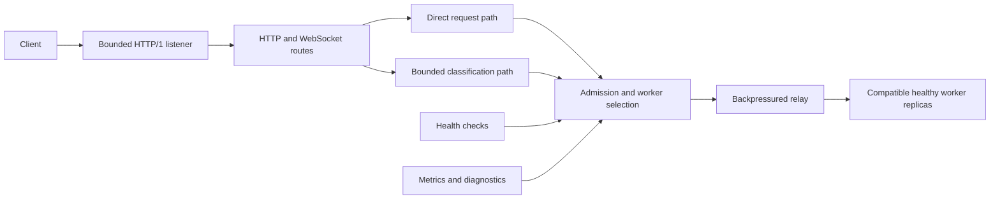

# SGLang-Omni Rust Router

`sgl-omni-router` is the multi-threaded Rust data plane for SGLang-Omni. It
routes OpenAI-compatible chat, speech, transcription, translation, and
realtime requests across compatible worker replicas with bounded admission,
health-aware selection, and backpressured streaming.

## Overview

- OpenAI-compatible HTTP and WebSocket routes for Omni, TTS, and ASR workers.
- Static worker manifests with explicit model, modality, and media contracts.
- `round_robin` and `least_requests` routing over compatible healthy replicas.
- Direct request streaming for homogeneous worker cohorts and bounded
  classification when routing depends on the request body.
- Pooled upstream HTTP/1.1 connections with request-ID propagation and direct
  response backpressure.
- Status-based health checks, exact admission and active-request accounting,
  Prometheus metrics, diagnostics, and graceful shutdown.



## Installation

### Prerequisites

- **Rust and Cargo**

  ```bash
  # Install rustup (Rust installer and version manager)
  curl --proto '=https' --tlsv1.2 -sSf https://sh.rustup.rs | sh

  # Reload shell environment
  source "$HOME/.cargo/env"

  # Verify installation
  rustc --version
  cargo --version
  ```

- **SGLang-Omni**, installed using the
  [installation guide](../get_started/installation.md), for running model
  workers.

The Rust router is built from this repository as a separate binary. It routes
requests to configured SGLang-Omni workers but does not install, launch, or
supervise them.

### Rust Binary

```bash
git clone https://github.com/sgl-project/sglang-omni.git
cd sglang-omni/sglang_omni_router/rust

# Build release binary
cargo build --release --locked
```

`rust-toolchain.toml` selects the supported Rust toolchain. The optimized
binary is written to `target/release/sgl-omni-router`.

## Checking Version

After installation, verify the installation and check the version:

```bash
./target/release/sgl-omni-router --version
```

## Quick Start

Choose the example that matches the worker service:

| Configuration | Worker service |
| --- | --- |
| `examples/omni.toml` | Multimodal chat with text or audio output |
| `examples/tts.toml` | Speech synthesis, including PCM streaming |
| `examples/asr.toml` | Transcription and speech-to-English translation |

The examples define two workers at `127.0.0.1:8000` and
`127.0.0.1:8001`. Set the worker URLs, model IDs, and service
profiles to match the processes you are running.

Validate the configuration before starting the router:

```console
./target/release/sgl-omni-router \
  --config examples/omni.toml \
  --check-config
```

Start the router:

```console
./target/release/sgl-omni-router --config examples/omni.toml
```

Wait for readiness and send a request:

```console
curl --fail http://127.0.0.1:30000/ready

curl --http1.1 http://127.0.0.1:30000/v1/chat/completions \
  --header 'content-type: application/json' \
  --data-binary \
  '{"model":"omni-model","messages":[{"role":"user","content":"hello"}]}'
```

## Configuration

Configuration is strict UTF-8 TOML. Unknown fields, duplicate fields, missing
required sections, unsupported schema versions, invalid tracing filters, and
invalid limits fail validation. `--check-config` validates the file without
creating a Tokio runtime, binding the listener, initializing tracing, probing
workers, or changing process limits.

The top-level sections are:

| Section | Purpose |
| --- | --- |
| `server` | Listener address, accepted-connection limit, and request-head timeout |
| `shutdown` | Graceful drain deadline |
| `logging` | Structured log format and tracing filter |
| `router` | Routing policy and optional voice owner |
| `admission` | Global and per-service in-flight limits |
| `health` | Probe interval, timeout, and transition thresholds |
| `http` | Shared upstream connection pool and aggregate buffering budget |
| `http_generation` | Chat trust domain, request limits, and deadline |
| `http_media` | Enabled media routes, trust domain, request limits, and deadline |
| `websocket` | Speech and realtime routes with setup and close bounds |
| `workers` | Worker identity, endpoint, health path, session capacity, and service profiles |

Each worker has a stable ID, base URL, trust domain, optional default model,
health path, session capacity, and one or more correlated service profiles.
A profile row describes a combination the worker supports; the router never
combines independent fields from different rows.

DNS worker authorities are resolved when an upstream connection is opened, so
health probes and new data connections follow DNS changes. Worker membership
remains static for the process lifetime.

Configuration limits are deployment budgets. Set admission, connection-pool
limits, and timeouts from the expected workload and worker topology.

## Supported APIs

| Method | Path | Purpose |
| --- | --- | --- |
| `GET` | `/live` | Process liveness |
| `GET` | `/ready` | Readiness of every enabled service |
| `POST` | `/v1/chat/completions` | Chat and multimodal generation |
| `POST` | `/v1/audio/speech` | Encoded speech or streaming PCM |
| `POST` | `/v1/audio/speech/batch` | Ordered, unsplit speech batch |
| `POST` | `/v1/audio/transcriptions` | Multipart transcription |
| `POST` | `/v1/audio/translations` | Multipart translation |
| `GET` | `/v1/audio/speech/stream` | Speech WebSocket |
| `GET` | `/v1/realtime[?model=<id>]` | OpenAI-compatible realtime WebSocket |
| `GET`, `POST` | `/v1/audio/voices` | List or upload worker-local voices |
| `DELETE` | `/v1/audio/voices/{name}` | Delete a worker-local voice |
| `GET` | `/v1/models` | Static model inventory |
| `GET` | `/metrics` | Prometheus lifecycle and capacity metrics |
| `GET` | `/diagnostics` | Bounded router state |

Generation requests use HTTP/1.1, JSON content type, and no query string.
Fixed-length and chunked request bodies are accepted. A single
`Expect: 100-continue` is handled by the client connection and is not forwarded
upstream. Ambiguous framing, trailers, other expectations, unsupported content
encoding, and oversized uploads are rejected before dispatch.

A canonical `x-request-id` identifies each request. A valid caller value is
preserved; otherwise the router generates one. The same value is sent to the
worker and returned to the client.

## Routing and Relay

### Request paths

The direct path is available when every eligible replica in a trust-scoped
cohort has the same concrete default model and compatible profile contract.
Heterogeneous pools use the classified path. The optional
`x-sglang-omni-route-model` and `x-sglang-omni-route-stream` headers are checked
against the classified body and are not forwarded upstream. The router relays
a direct request body as a backpressured stream.

Requests that require body-owned routing facts reserve aggregate byte capacity,
read the body once, and classify the model, content forms, media placement,
input and output modalities, response format, and stream mode. Classification
runs on Tokio's blocking pool with execution limited to the available CPU
parallelism, while the aggregate buffered-byte budget bounds concurrent
classifier memory. The original bytes are forwarded without reconstructing
JSON or multipart content.

The direct path is bounded by each route's `streamed_request_max_bytes`. The
classified path is bounded by the route's `buffered_request_max_bytes` per
request and `http.buffered_request_total_bytes` across chat and media requests.
Their defaults are 512 MiB, 8 MiB, and 256 MiB respectively. Chunked classified
requests acquire the shared budget as bytes arrive. Requests without an
explicit model return `ambiguous_model` when compatible workers do not share
one default. Classified JSON follows the standard JSON number grammar;
non-standard `NaN` and `Infinity` tokens are rejected.

Classification completes before worker selection, so classification
does not occupy an upstream connection.

### Worker selection

`round_robin` rotates across compatible healthy replicas. `least_requests`
compares active requests and rotates equal ties. Selection increments the
chosen worker's load before dispatch and performs no network or body work while
holding the policy lock.

Routing policy is workload-specific. Use full-corpus measurements at the target
concurrency to choose between the supported policies.

### Admission and backpressure

Global admission counts request envelopes. Per-service admission counts
requests or sessions, except speech-batch admission, which counts batch items.
Admission is fail-fast, and its permits and worker-load guard remain held until
response EOF, upstream error, or downstream cancellation. The worker remains
responsible for its execution and queue capacity.

The router sends one upstream request through a shared HTTP/1.1 connection
pool. Redirects, ambient proxies, retries, and automatic decompression are
disabled. Request and response bodies use direct backpressure without a body
pump, application queue, or extra relay task.

The request deadline covers upload, connection establishment, and upstream
response headers. A final worker response received before the upload completes
is rejected as an upstream protocol error and is not committed downstream.
After response headers are committed, the response has no total wall-clock
limit.

Responses still end normally on upstream EOF or error, downstream disconnect,
or process drain.

## Media and Realtime Sessions

Media routes are enabled independently. Speech batches remain ordered and are
never split. Classified transcription and translation requests buffer the full
multipart upload, so heterogeneous ASR deployments must size the buffered
limits for their largest accepted recordings. Transcription and translation
share a capacity class but require separate profile tasks.

The router preserves the trusted worker's response content type together with
JSON, text, SSE, encoded audio, raw PCM, sample-rate and channel metadata,
usage, completion-token, and finish-reason contracts. It does not decode,
transcode, or regenerate audio.

Speech and realtime WebSockets terminate both handshakes and pin one worker for
the complete session. Each frame awaits its destination send, preserving frame
type and order without relay tasks or application queues. Both links use a 16
MiB message bound. Speech configuration, upstream transport setup, the first
worker event, and close convergence use separate deadlines. Application-level
idle behavior remains worker-owned. A realtime `model` query requires a worker
with the matching default; an omitted model can use any compatible worker in
the trust domain. `worker_setup_timeout_ms` is an operator safety bound on the
initial worker application event; it does not limit session lifetime or mark a
worker unhealthy when it expires.
Speech configuration is replayed byte-for-byte; the router extracts routing
facts while the worker owns protocol-value validation.

Uploaded voices have one explicit owner configured by
`router.voice_owner_worker_id`. Voice CRUD and uploaded-name requests are
pinned to that worker. Preset names and explicit references continue to use
normal worker selection. The router does not store, replicate, or reconcile
worker-local voice data. `voice_name_policy = "preset"` declares names provided
by the serving model. `voice_name_policy = "uploaded"` declares names resolved
from worker-local voice state; hybrid pipelines should use `uploaded` so named
requests are routed conservatively. A named-voice request is rejected when
otherwise compatible profiles disagree on this policy.
Qwen3-TTS CustomVoice profiles use `preset`; Qwen3-TTS Base, Higgs, and hybrid
dots-style profiles use `uploaded`.

## Health and Readiness

Workers start with unknown health. Each worker has one serial probe loop that
applies the configured consecutive success and failure thresholds.
Transport and upstream protocol failures can request an immediate coalesced
probe. Application responses do not directly change worker health.

`GET /ready` returns `200` while the process is serving and every enabled
generation, media, and WebSocket service has a compatible healthy worker.
Readiness also requires the configured uploaded-voice owner to be healthy and
compatible. Current worker load does not change readiness.

## Operations

`/v1/models` returns a sorted, deduplicated inventory built from worker defaults
and correlated profile model IDs. `/metrics` exposes Prometheus lifecycle,
readiness, health, admission, worker-load, listener, buffered-byte,
classification-slot, and WebSocket-session gauges. It also exposes cumulative
request and response-header counts, router-generated faults, saturation
rejections, worker probe outcomes, classification outcomes, WebSocket
termination reasons, and committed HTTP response-body outcomes.

The response-header histogram measures from router boundary entry until an HTTP
response is available. It does not measure response-body completion, streaming
TTFT, or WebSocket-session duration. Requests cancelled before that boundary
are counted separately. Classification histograms separate slot wait,
blocking-executor wait, and execution for each request kind. Blocking work that
outlives a caller timeout or cancellation records its phase durations when that
work starts or finishes, without changing the caller's terminal outcome.
WebSocket termination counters distinguish setup from active relay and record
one bounded terminal cause per upgraded session. They do not measure completion
of the bounded close handshake. HTTP response-body counters distinguish
complete bodies, upstream body errors, and bodies dropped before completion.
The post-commit relay-failure counter is the upstream-error subset.
`/diagnostics` returns bounded deterministic JSON for the same router-local
state and marks the configured voice owner. Each diagnostic worker includes
cumulative dispatch counts for the fixed service classes and voice-control
operations. A speech batch contributes one dispatch while active worker load
remains item-weighted. Workers also include their latest probe result, HTTP
status when present, observation time, transition streaks, and cumulative
outcomes.

Operations responses snapshot router-local state and never contact workers.
Admission values come from the semaphores that enforce router limits. Worker
load comes from the same counters used by `least_requests`. Metric labels use
fixed vocabularies instead of worker IDs, model IDs, request IDs, paths, or
client input. Listener usage includes the slot reserved by the pending accept.
registered WebSocket sessions represent callbacks retained for shutdown.

Structured logging covers lifecycle events, health transitions, and exceptional
conditions. `logging.filter` accepts a tracing filter expression, and
`logging.format` accepts `json` or `compact`.

## Networking and Shutdown

`server.max_connections` bounds accepted client sockets. The listener acquires
capacity before `accept`, and the accepted transport retains the permit through
HTTP upgrade until the socket closes. Accepted sockets enable `TCP_NODELAY`.

`server.header_read_timeout_ms` limits each initial or keep-alive HTTP/1 request
head. It does not limit request bodies, active handlers, responses, streams, or
upgraded transports. Connection-level accept errors retry immediately; other
accept errors are logged and retried after one second.

On Unix, startup attempts to raise the `RLIMIT_NOFILE` soft limit to `65,535`.
If the process hard limit prevents that, the router logs a warning and continues.
Set the process file limit for the deployment's configured connection and
admission concurrency.

The first `SIGINT` or `SIGTERM` closes admission, stops health work, drops the
listener, and drains owned tasks. A distinct second signal or the drain
deadline aborts and joins remaining work and exits with failure.

## Security and Deployment

The router uses one static manifest and one multi-threaded process. It supports
numeric loopback and non-loopback listener addresses, Linux hosts and
containers, and MPS data-parallel worker deployments without a Python
control-plane/data-plane split.

The router does not implement client authentication or terminate TLS. Deploy it
on a trusted network or behind an authenticated TLS proxy.

Dynamic worker discovery and CRUD, request retries, circuit breakers,
cache-aware routing, prefill/decode routing, and worker supervision are outside
this router's data-plane contract.

## Development

### Toolchains

Install the pinned implementation toolchain and minimum-supported Rust version:

```console
rustup toolchain install 1.97.1 \
  --profile minimal \
  --component clippy,rustfmt
rustup toolchain install 1.90.0 --profile minimal
```

`rust-toolchain.toml` selects Rust 1.97.1 for normal commands. Rust 1.90.0 is
used only for compatibility checks.

### Shared build cache

Cargo writes build artifacts to `target/` by default. Developers using multiple
Git worktrees can share one build directory:

```console
export CARGO_TARGET_DIR="${XDG_CACHE_HOME:-$HOME/.cache}/sglang-omni-router/target"
```

Cargo coordinates concurrent access to the shared directory. Different
toolchains, profiles, targets, and feature sets retain separate fingerprints.
When `CARGO_TARGET_DIR` is set, Cargo writes the binary to
`$CARGO_TARGET_DIR/release/sgl-omni-router`.

### Quality gates

Run the same checks used by CI:

```console
cargo fmt --all -- --check
cargo +1.90.0 check --workspace --all-targets --all-features --locked
cargo clippy --workspace --all-targets --all-features --locked -- -D warnings
cargo test --workspace --all-targets --all-features --locked -- --test-threads=1
RUSTDOCFLAGS="-D warnings" \
  cargo doc --workspace --all-features --no-deps --locked
cargo build --release --workspace --all-features --locked
```

Validate all tracked deployment examples with the release binary:

```console
binary="${CARGO_TARGET_DIR:-./target}/release/sgl-omni-router"
git ls-files -- 'examples/*.toml' | LC_ALL=C sort | while IFS= read -r config; do
  "$binary" --config "$config" --check-config
done
```

Unit tests live next to the implementation they exercise. Process, HTTP,
media, WebSocket, and voice integration tests live under `tests/` and use real
loopback sockets where transport behavior is part of the contract.

### Source layout

| Path | Responsibility |
| --- | --- |
| `src/config.rs` | Strict configuration and cross-field validation |
| `src/server.rs` | Runtime assembly, routes, listener, and shutdown |
| `src/worker_pool/` | Admission, health, profiles, policy selection, and worker load |
| `src/http_relay/` | Shared HTTP client, buffering, body adapters, and relay |
| `src/http_generation/` | Chat validation and classification |
| `src/http_media/` | Speech, batch, transcription, translation, and voices |
| `src/websocket/` | Speech and realtime session setup and relay |
| `src/operations.rs` | Models, metrics, and diagnostics |
| `tests/` | Process and protocol integration tests |

## Python Router

The Python router remains available as `sgl-omni-router-py`. Its guide is
`docs/basic_usage/python_router.md`.
